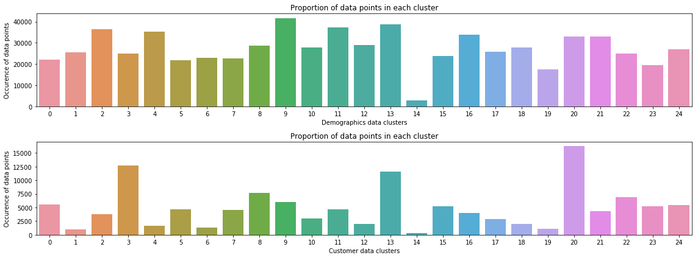

# Identify_customer_segments
Apply unsupervised learning techniques to identify segments of a customer base

# Unsupervised Learning
## Identify customer segments

### Objectives

Apply unsupervised learning techniques to identify segments of the population that form the core customer base for a mail-order sales company. These segments can then be used to direct marketing campaigns toward audiences that will have the highest expected rate of returns.


#### Approach

We use two datasets: a demographics data for the general population and another demographics data for the customers of the mail-order company.    
- Step 1: We cluster the general population into groups with similar demographic properties.
- Step 2: We see how the people in the customers dataset fit into the clusters created previously.   
The hope is that certain clusters are over-represented in the customer data, as compared to the general population. They will be assument to be part of the core userbase. This information can then be used for further applications, such as targeting for a marketing campaign.      
    
### Results

We compute the proportion of data in each cluster for the general population and the customer data:   

    

The over-represented clusters in the customers dataset are the clusters 3, 13 and 20.    
The under-represented ones the clusters 4, 6, 10 and 12.     
In reality, we do not have higher proportion of persons in a cluster for the customer data compared to the general population. So it suggests that the people we are looking for are outside of the target demographics.   


### Analysis steps

1. Preprocessing
	- Missing values have been re-encoded. The columns with large amount of missing values have been removed.  
	- Mixed-type features have been re-engineered
	- The data has been splitted according to how much data is missing. The subsets have compared. One has been selected. 
	- Categorical features have been explored and transformed.   

2. Feature Transformation
	- We applied feature scaling and used Imputation to remove remaining missing values.
	- Principal component analysis has been applied to the data. We performed a variability analysis.    

3. Clustering  
	- We tested multiple cluster counts, then made a decision on the number of clusters to be used.    

After all that on the general demographics data, we applied cleaning, feature transformation, dimensionality reduction, and clustering models to the customer demographics data.   

### Install

This project requires **Python 3.x** and the following Python libraries installed:

- [NumPy](http://www.numpy.org/)
- [Pandas](http://pandas.pydata.org)
- [matplotlib](http://matplotlib.org/)
- [seaborn](https://seaborn.pydata.org/)
- [sklearn](https://scikit-learn.org/stable/index.html)    

You will also need to have software installed to run and execute an [iPython Notebook](http://ipython.org/notebook.html)

We recommend to install [Anaconda](https://www.continuum.io/downloads), a pre-packaged Python distribution that contains all of the necessary libraries and software for this project. 

### Code

The code is provided in the `image_classifier.ipynb` notebook file. The code included in `visuals.py` is meant to provide the visualizations created in the notebook.

### Run

In a terminal or command window, navigate to the top-level project directory `classify_images_with_PyTorch/` (that contains this README) and run one of the following commands:

```bash
ipython notebook image_classifier.ipynb
```  
or
```bash
jupyter notebook image_classifier.ipynb
```

This will open the iPython Notebook software and project file in your browser.

### Data

The proprietary data we use has been provided by Bertelsmann Arvato Analytics, and consequently is not available here.
